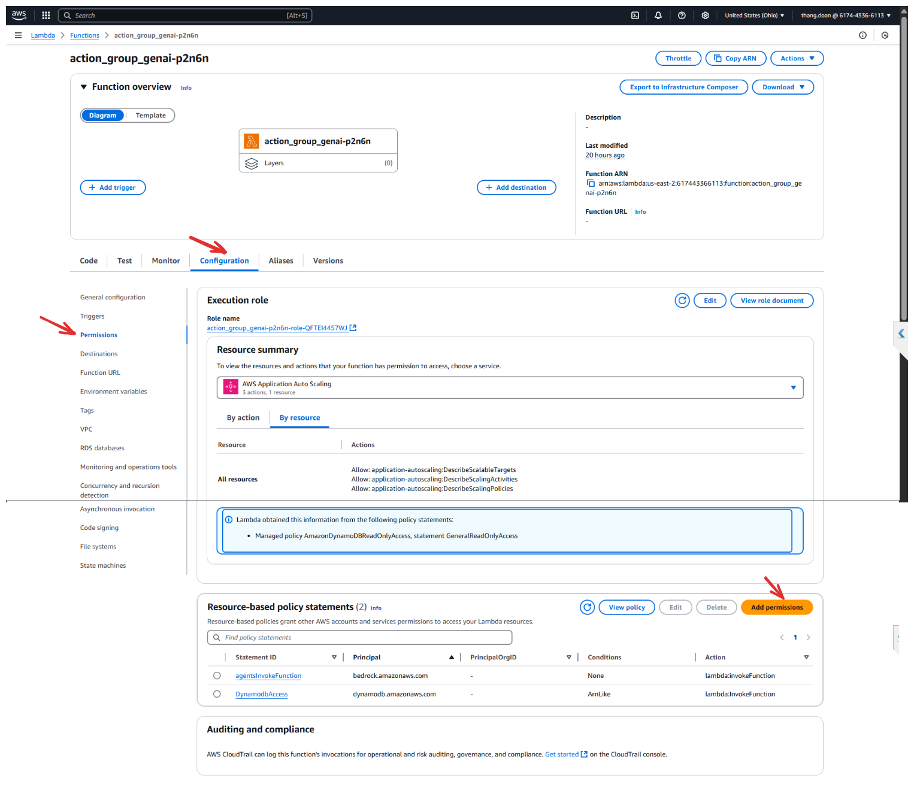
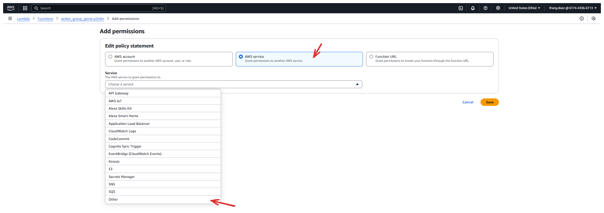
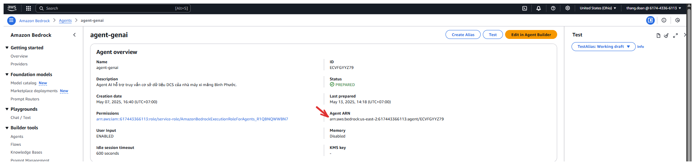
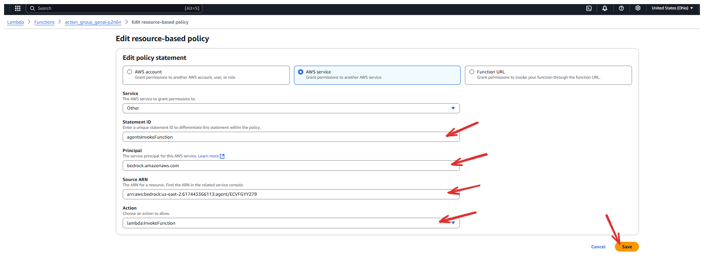
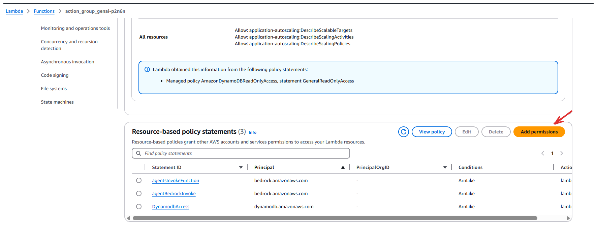
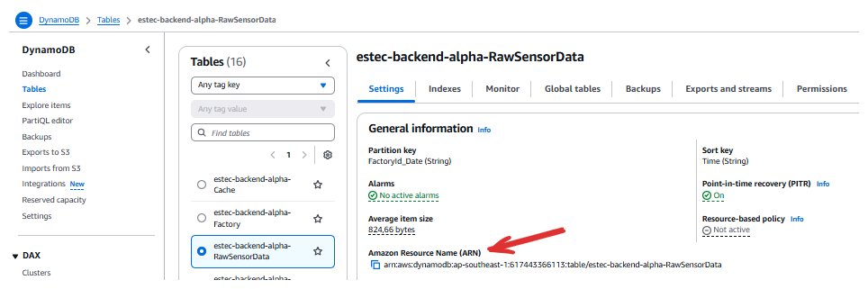
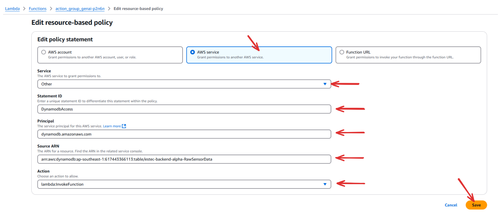

# Add Lambda policy to allow Amazon Bedrock access to invoke the Lambda function. ( Thêm chính sách của Lambda cho phép Amazon Bedrock truy cập gọi hàm Lambda ) 

- **Click** **Configuration** - **Permissions** - **Add** **permissions**

- Choose the **AWS Service**
	- Choose the **Other option**

- **Enter** the **Statement ID**
	- **Example** : allowBedrockInvoke
- **Enter** the **Principal**
	- **Example** : bedrock.amazonaws.com
- **Enter** the **Source** **ARN**
> [!info]
> - Example : You can get the Source ARN of Bedrock in this 
> - 
- **Enter** the **Action**
	- **Example** : lambda: InvokeFunction
- **Click Save**

---
# Add Lambda policy to allow DynamoDB access to invoke the Lambda function. ( Thêm chính sách của Lambda cho phép DynamoDB truy cập gọi hàm Lambda ) 

- Click Add permissions

- Choose the **AWS Service**
	- Choose the **Other option**
- **Enter** the **Statement ID**
	- **Example** : DynamodbAccess
- **Enter** the **Principal**
	- **Example** : bedrock.amazonaws.com
- **Enter** the **Source** **ARN**
> [!info]
> **Example** : You can get the Source ARN of DynamoDB in this  
> 	 

 **Click Save** after **enter all the information**.