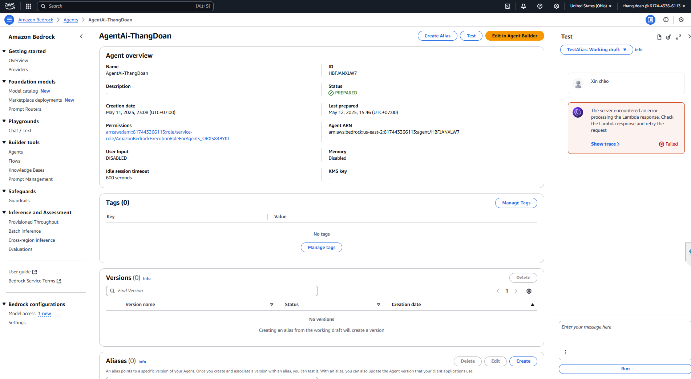

# Solution for Error "The server encountered an error processing the Lambda response. Check the Lambda response and retry the request"

## You can update your solution in here if you can resolve that

---
# Solution for Error "Failed to create or update ActionGroup. Try providing either apiSchema or functionSchema"

## Provide the appropriate schema:

- If **interacting with an API**: Prepare the OpenAPI (Swagger) specification for that API and provide it as the `**apiSchema**`.
- If **calling functions**: **Define** the **JSON schema for the functions** you want to call (including names, descriptions, parameters) and provide it as the **`functionSchema`**. Ensure the schema is valid: Thoroughly check the syntax and content of the `apiSchema` or `functionSchema` to ensure they are correctly formatted and accurately describe the APIs or functions. Try creating or updating the ActionGroup again after providing a valid schema.
	- **Example** : 1. Services/sample_inline_openAPI_schema.yaml