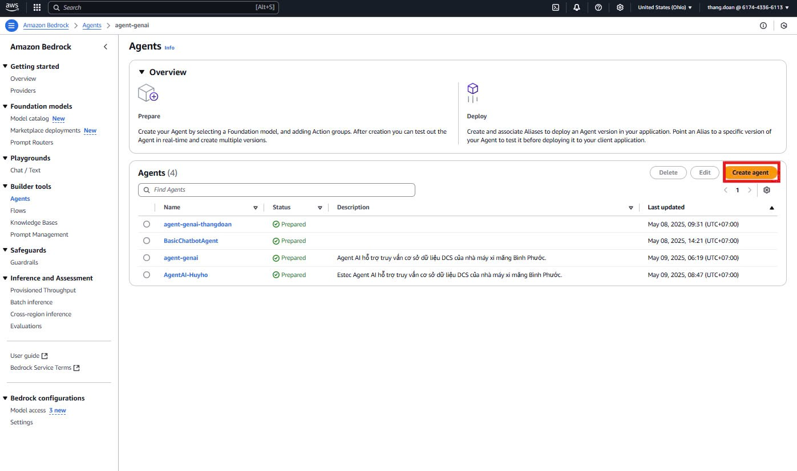
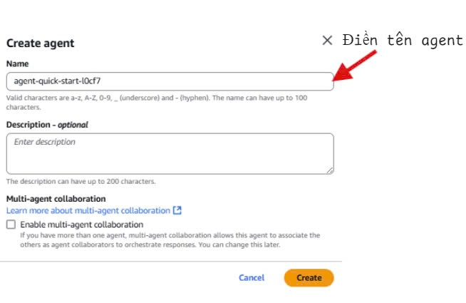
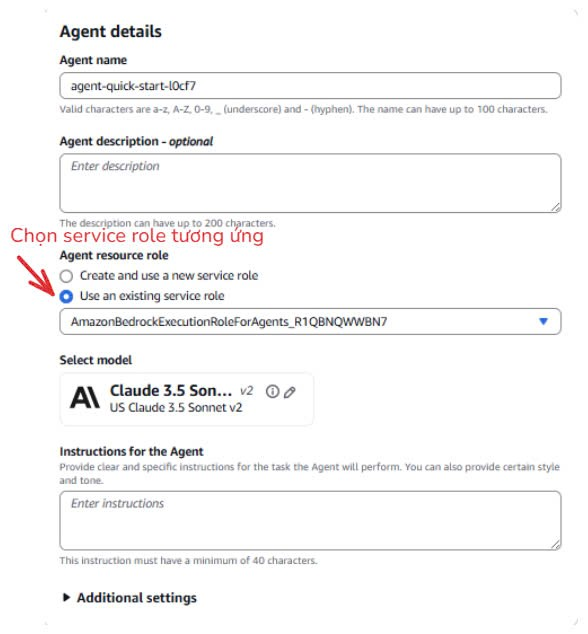
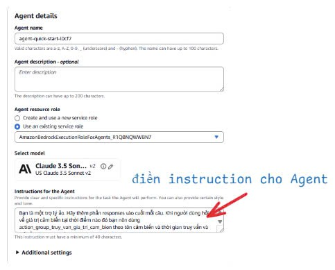
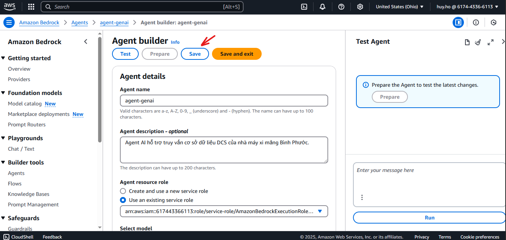

# GenAI---AWS---ESTEC-R_and_D
This repository will guide gradually setting up geniel in the AWS environment ☁️
# Section 1: Start setup 🚀
## Step 1.1: Create Agent 🤖
- Click "**Create agent**" button at the right corner
    
- Enter the name for **Agent Name** field
  - **Example**: AgentAI-Estec
- Enter the description for **Agent Description** field
  - **Example**: Estec Agent AI hỗ trợ truy vấn cơ sở dữ liệu DCS của nhà máy xi măng Bình Phước.
    
- Choose option "**Use an existing service role**"
    
- Select model for agent
    
- Enter the instructions for "**Instructions for the Agent"** field
  - **Example**: Bạn là một trợ lý ảo. Hãy thêm phần responses vào cuối mỗi câu. Khi người dùng hỏi về giá trị cảm biến tại thời điểm nào đó bạn nên dùng action_group_truy_van_gia_tri_cam_bien theo tên cảm biến và thời gian truy vấn và trả về giá trị tương ứng 
    
- Click "**Save**" button to save setting
    
## Step 1.2: Create Action Group