# GenAI---AWS---ESTEC-R_and_D
This repository will guide gradually setting up geniel in the AWS environment ☁️
# Section 1: Start setup 🚀
## Step 1.1: Create Agent 🤖
- Click "**Create agent**" button at the right corner

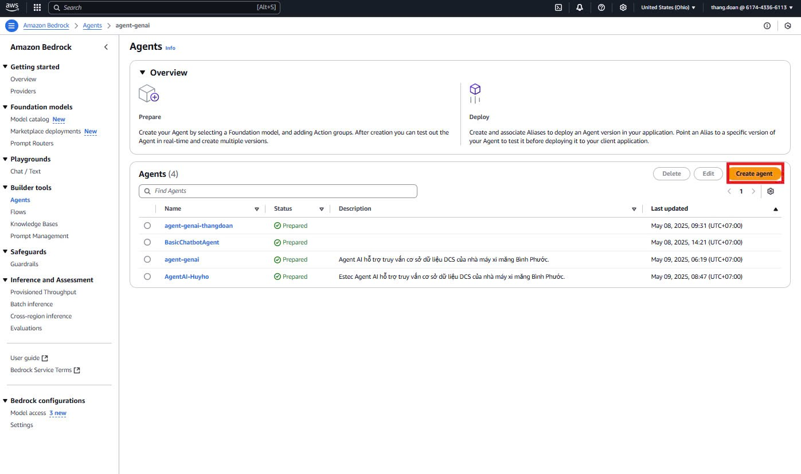
- Enter the name for **Agent Name** field
- **Example**: AgentAI-Estec
- Enter the description for **Agent Description** field
- **Example**: Estec Agent AI hỗ trợ truy vấn cơ sở dữ liệu DCS của nhà máy xi măng Bình Phước

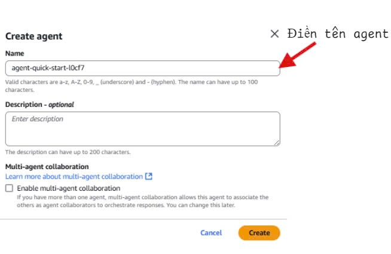
- Choose option "**Use an existing service role**"

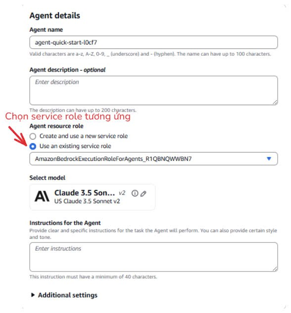
- Select model for agent

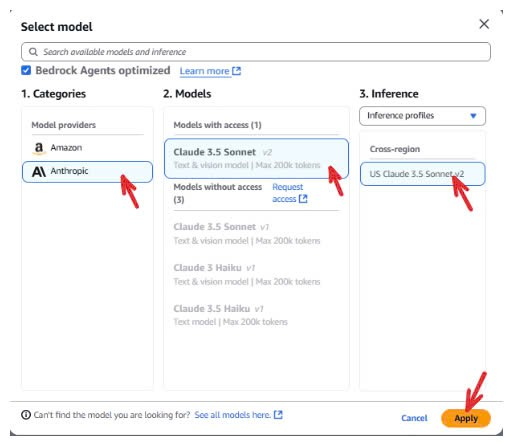
- Enter the instructions for "**Instructions for the Agent"** field
- **Example**: Bạn là một trợ lý ảo. Hãy thêm phần responses vào cuối mỗi câu. Khi người dùng hỏi về giá trị cảm biến tại thời điểm nào đó bạn nên dùng action_group_truy_van_gia_tri_cam_bien theo tên cảm biến và thời gian truy vấn và trả về giá trị tương ứng.

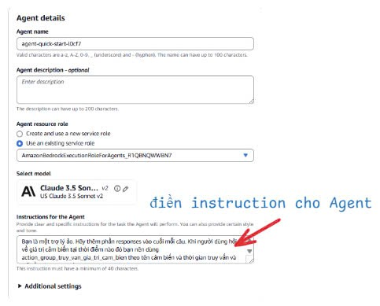
- Click "**Save**" button to save setting

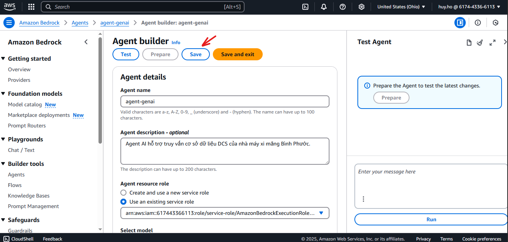
---
## Step 1.2: Create Lambda Function 🔺
- Click "**Create function**" button to create Lambda Function

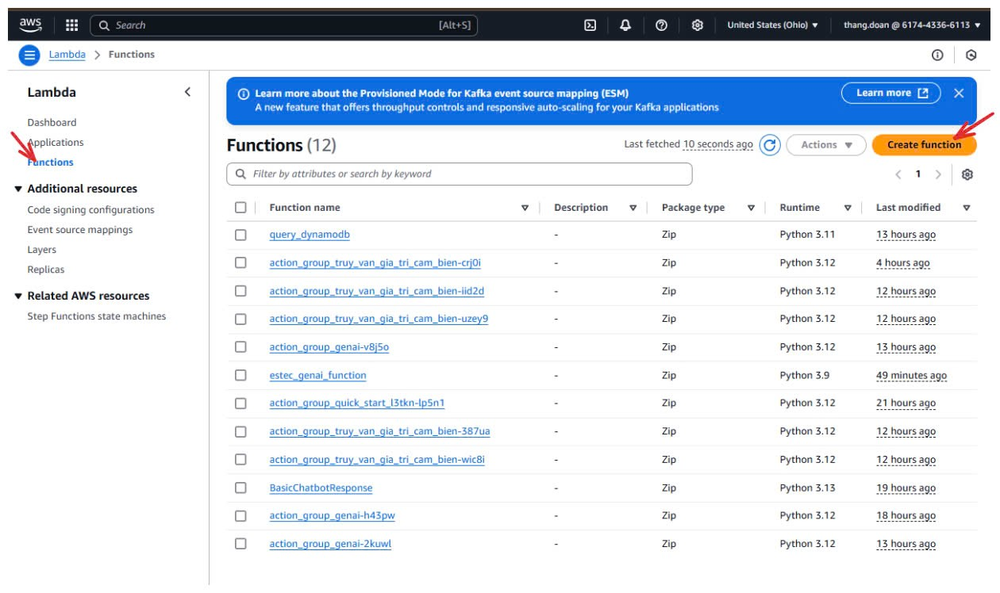
- Choose **Author from scratch**
- Enter function name for **Function name** field
- Choose language for lambda function
- Choose **x86_64** option
- Click "**Create function**" button at right footer corner to complete create new lambda function

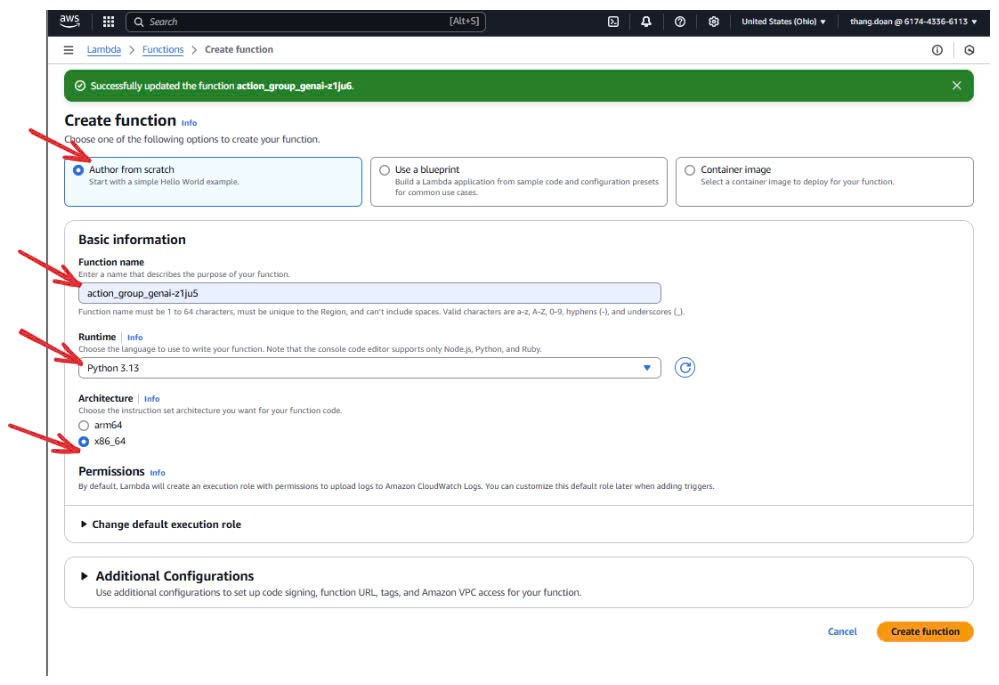

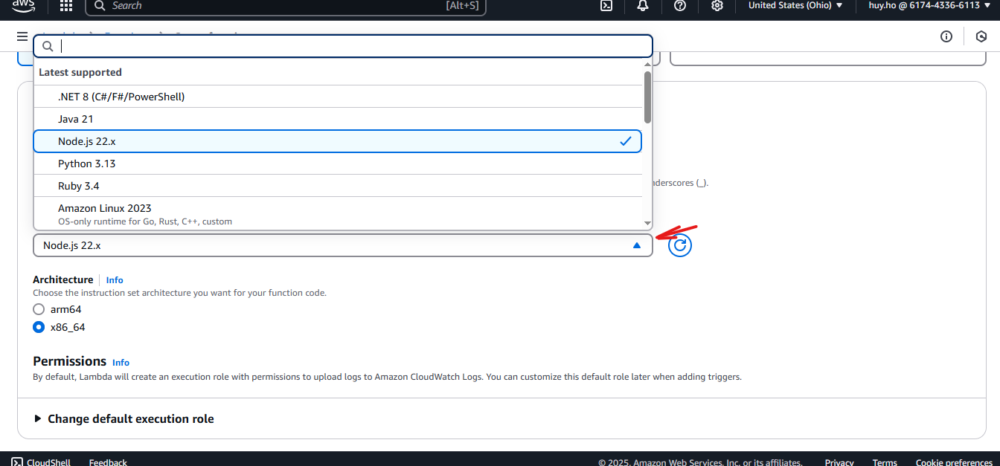
---
## Step 1.3: Create Action Group 🤝
- Click "**Add**" button to create Action Group
  
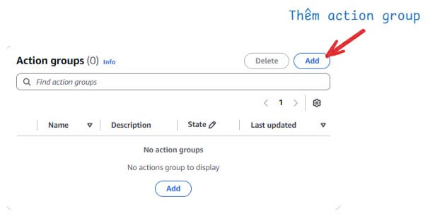
- Enter the **Action group name** field
  - **Example**: action_group_estec_genai
- Enter the **Description** field
  - **Example**: Action group này dùng để truy xuất thông tin người dùng từ bảng DynamoDB được cung cấp. Agent sẽ gọi Lambda function để truy vấn dữ liệu từ DynamoDB và trả về kết quả phù hợp.

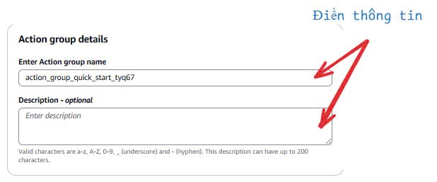
- Choose **Define with API schemas** option

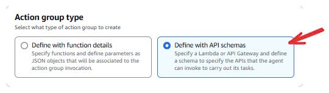
- Choose **Select an existing Lambda function** option in **Action group invocation**

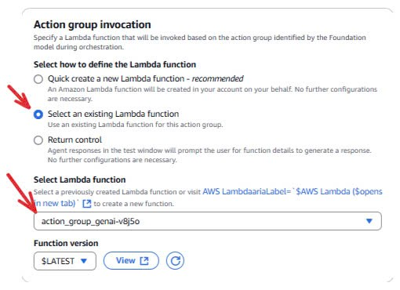