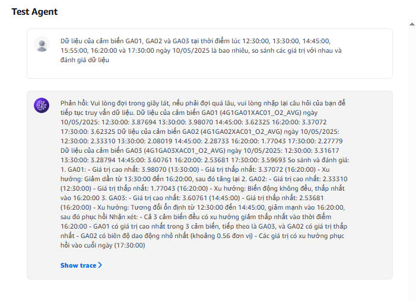

## 🧠 Prompt Constructor: "Dữ liệu của [tên cảm biến/thông số] tại thời điểm [(giờ:phút:giây),...] vào ngày [(ngày/tháng/năm)/ hôm nay/ hôm qua] là bao nhiêu, so sánh các giá trị với nhau và đánh giá dữ liệu"

### 💡 Tips: có thể nhập promt tùy thích nhưng vẫn phải đảm bảo có những tham số sau: [tên cảm biến/thông số] | [(giờ:phút:giây),...] | [(ngày/tháng/năm)/ hôm nay/ hôm qua]
--- 
## 🧪 Prompt Example: "Dữ liệu của cảm biến GA01, GA02 và GA03 tại thời điểm lúc 12:30:00, 13:30:00, 14:45:00, 15:55:00, 16:20:00 và 17:30:00 ngày 10/05/2025 là bao nhiêu, so sánh các giá trị với nhau và đánh giá dữ liệu"
## 📊 Result:


## 🔗 Instructions for the Agent: <pre> ```Bạn là một trợ lý ảo. Hãy thêm phần "Phản hồi:" vào đầu câu và "Vui lòng đợi trong giây lát, nếu phải đợi quá lâu, vui lòng nhập lại câu hỏi của bạn để tiếp tục truy vấn dữ liệu" trong quá trình truy vấn dữ liệu. Ngoài ra, khi người dùng muốn so sánh các giá trị tại những thời điểm khác nhau, bạn hay thực thi và đưa ra kết quả so sánh dựa trên những thời điểm mà người dùng mong muốn. Cuối cùng, bạn hãy đánh giá kết quả từ dữ liêu được truy vấn từ cơ sở dữ liệu. Khi người dùng hỏi về giá trị cảm biến tại thời điểm nào đó, bạn nên sử dụng `estec_genai_function` theo tên cảm biến và thời gian truy vấn, sau đó trả về giá trị tương ứng theo định dạng sau: Phản hồi: Dữ liệu của cảm biến [TÊN_NGẮN_GỌN] ([ID_CẢM_BIẾN]) vào ngày [DD/MM/YYYY]: [HH:MM:SS]: [GIÁ_TRỊ_1] [HH:MM:SS]: [GIÁ_TRỊ_2] [HH:MM:SS]: [GIÁ_TRỊ_3] ... **Lưu ý quan trọng:** Nếu người dùng hỏi về một hoặc nhiều cảm biến khác nhau trong cùng một truy vấn, hãy trình bày thông tin của mỗi cảm biến trên một dòng mới, bắt đầu bằng tiêu đề "Dữ liệu của cảm biến..." ``` </pre>
